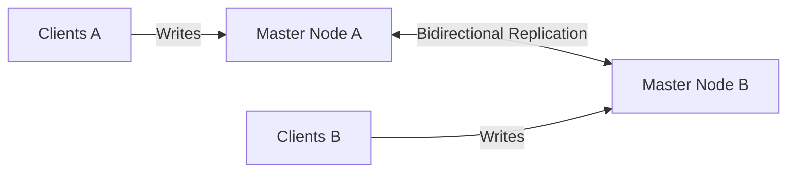
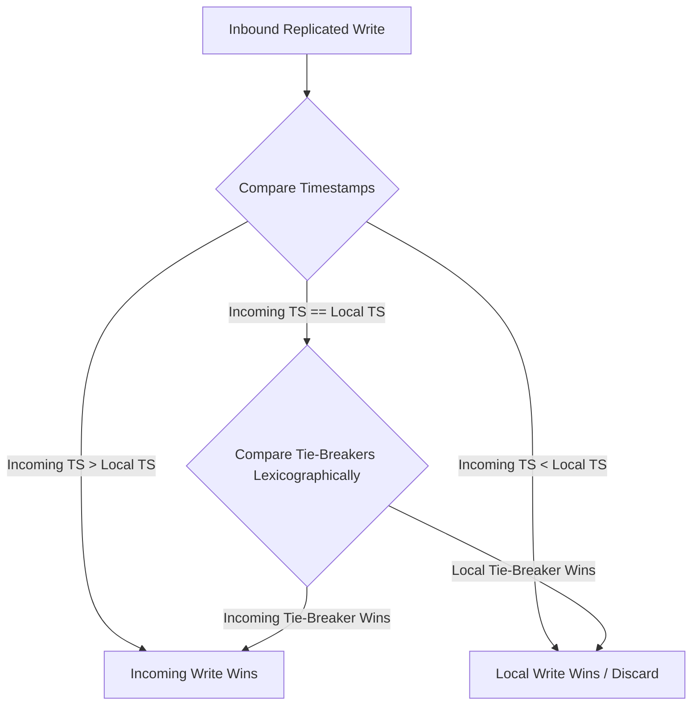
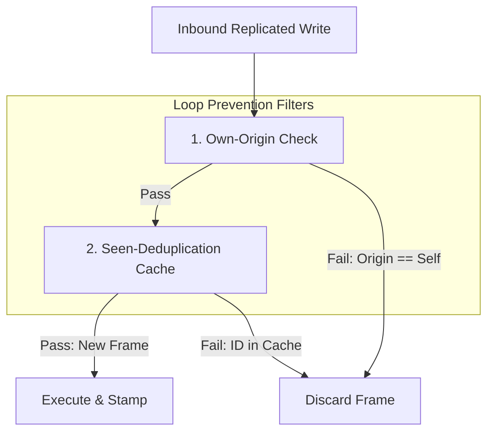

# Valkey Active-Active Replication: Architectural Design, Gaps, and Trade-offs

This document provides an architectural analysis of the active-active multi-master replication model, focusing on conflict resolution, loop prevention, design trade-offs, and critical gaps under network partitions.

---

## 1. Replication Architecture Overview

The active-active design configures master nodes as mutual upstreams, establishing a bidirectional replication mesh. 



Writes originating on any master are packaged into replication frames and fanned out to all peers. The propagation envelope carries metadata tracking the originating node, transaction sequences, and logical clock states to enable conflict resolution and loop prevention on the receiving end.

---

## 2. Conflict Resolution State & Protocol

To maintain eventual consistency across partitioned or concurrently written masters, the architecture utilizes a key-level hybrid logical clock model to implement Last-Writer-Wins (LWW) resolution.

### 2.1 State Tracking

State is tracked at two distinct levels:

```
+--------------------------------------------------------------+
|                         NODE LEVEL                           |
|  - Seen-Frame Cache: Sliding window of recent transactions   |
|  - Delivery Logs: Pending replication queues and ACKs        |
+--------------------------------------------------------------+
                               |
                               v
+--------------------------------------------------------------+
|                         KEY LEVEL                            |
|  - Logical Timestamp: Last winning update clock              |
|  - Tie-Breaker: Globally unique transaction namespace        |
+--------------------------------------------------------------+
```

1.  **Key-Level Metadata**:
    *   **Logical Timestamp**: A 64-bit hybrid logical clock timestamp assigned to a key when it is modified. It is derived from the system's microsecond clock but advanced logically to preserve causal ordering.
    *   **Tie-Breaker String**: A globally unique string associated with the key's winning update. It is formatted as `<originating-node-uuid>:<transaction-sequence-id>`.
        *   **`transaction-sequence-id`**: The local `replay-id` sequence number generated by the originating master's local incrementing counter when it packages the write.
2.  **Node-Level Metadata**:
    *   **Node-Level Logical Clock**: A single 64-bit logical clock representing the node's current logical time. It is advanced locally on new writes (tied to the system microsecond clock) and synchronized with incoming replication frames by advancing to the peer's timestamp if the incoming timestamp is higher. This drives the generation of key-level timestamps.
    *   **Seen-Frame Cache**: A sliding-window filter table containing transaction identifiers of recently processed replication frames.
    *   **Delivery Tracking Logs**: Counters tracking the last sent, received, and acknowledged transaction sequence IDs for each peer link to manage buffering during temporary outages.

### 2.2 Conflict Resolution Protocol

When a node receives a replicated write for an existing key, it performs the following evaluations to determine the winner:



1.  **Logical Timestamp Check**: The incoming write's timestamp is compared to the key's current logical timestamp:
    *   If the incoming timestamp is newer, the incoming write wins and updates the database.
    *   If the local timestamp is newer, the incoming write is discarded as stale.
2.  **Deterministic Tie-Breaking**: If the timestamps are identical, the node falls back to comparing the tie-breaker strings lexicographically.
    *   Since the originating node's UUID is globally unique and the sorting behavior of standard string comparison is entirely deterministic, all nodes in the cluster will evaluate the tie-breaker identically and agree on the same winner.
    *   **When this happens**: Overlapping logical timestamps typically occur under two scenarios:
        1.  *Microsecond Concurrency*: Two client writes are executed on different masters within the same system microsecond (the clock's resolution limit).
        2.  *Partitioned Clock Branching*: During a partition, both nodes write to a key and increment their local clocks from the same historical base. When they reconnect, the writes from both sides carry identical logical clock values (e.g. $T_{base} + 1$).

---

## 3. Replication Trade-offs: Simplicity vs. Consistency

The hybrid logical clock model introduces distinct trade-offs regarding memory consumption, complexity, and data safety.

### 3.1 Clocks: Scalar vs. Vector Clocks

| Metric | Hybrid Scalar Clocks | Vector Clocks |
| :--- | :--- | :--- |
| **Structure** | Single numeric value per key (8 bytes). | List of clocks, one per master node ($O(N)$ size). |
| **Ordering** | **Total Ordering**: Always resolves a winner. | **Partial Ordering**: Identifies concurrent events. |
| **Conflict Strategy** | **Resolution**: Automatically forces LWW convergence. | **Detection**: Flags concurrent writes for manual/CRDT merge. |
| **Memory Overhead** | **Negligible**: Constrained per-key overhead. | **Significant**: Scalability drops as cluster size grows. |

*   **Trade-off Justification**: By selecting a scalar hybrid logical clock with a tie-breaker, the design prioritizes low memory footprint and automatic convergence. However, it trades off the ability to *detect* true concurrent conflicts, replacing them with a strict Last-Writer-Wins override.

### 3.2 Key-Level vs. Element-Level Merging (Data Safety)

Because conflict resolution is tracked at the **key level**, the system is only semantically safe for scalar types (Strings) and canonicalized field writes (Hashes/Sorted Sets):
*   **Strings & Hashes**: Safe because relative commands (e.g. `INCR`) are canonicalized to absolute updates before propagation.
*   **Lists & Sets**: **Unsafe**. Since the entire key is stamped with a single timestamp, concurrent modifications to different items within a List or Set on different masters cannot merge. The transaction with the older timestamp will be overwritten completely, leading to silent data divergence.

> [!NOTE]
> **CRDT Resolution Alternative**:
> If the system used CRDTs (Conflict-Free Replicated Data Types) instead of Last-Writer-Wins, it would be possible to avoid overwriting collection keys. 
> *   For **Sets**, we could use an *Observed-Remove Set (OR-Set)* where addition and deletion metadata are tracked per-element.
> *   For **Lists**, a *Sequence CRDT* (like LSeq or RGA) would allow elements to be merged by fractional positioning.
> 
> While this would make List and Set merging safe, it was avoided due to the significant trade-offs of increased implementation complexity, high CPU overhead, and the requirement to store metadata vectors for every single element, which dramatically expands memory usage.

---

## 4. Replication Loop Prevention

In a bidirectional mesh, write propagation must be strictly controlled to prevent infinite loops (where Node A sends a write to Node B, and Node B replicates it back to Node A indefinitely).



1.  **Own-Origin Check**: Each replication envelope carries the UUID of the master where the write first originated. When a node receives an envelope, it checks the originating UUID. If it matches its own local UUID, it immediately discards the frame.
2.  **Seen-Deduplication Cache**: 
    *   **Why this is needed**: In a multi-master mesh topology containing 3 or more nodes (e.g., A, B, and C connected in a triangle), updates propagate along multiple network paths. If Node A originates a write, Node C will receive it directly from A, but also via Node B (who received it from A and forwarded it). 
    *   **How it prevents loops**: By keeping a sliding-window cache of transaction IDs (`<origin-uuid>:<replay-id>`) that have already been executed, Node C recognizes when it receives a duplicate of A's write from B and discards it, preventing redundant executions and infinite circular forwarding.

---

## 5. Architectural Design Gaps

Under network partitions, the active-active model exposes two significant design gaps that break consistency and lead to data loss.

### 5.1 The Replication ID Invariant Violation

Standard Valkey is designed as a single-master system where a replication ID represents a single, linear history:
*   **The Invariant**: If two nodes share the same replication ID, they must share the same database state at any matching replication offset.
*   **The Gap**: In this active-active fork, when a partition occurs, both master nodes remain active and continue accepting client writes. They retain the same replication ID but build divergent timelines.
*   **Consequences**: The replication ID is "branched". Offset `200` on Node A contains writes for `keyA`, while offset `200` on Node B contains writes for `keyB`. This breaks the core state-matching logic of the replication engine.

### 5.2 Backlog-Driven Full Sync Fallback

To propagate writes, master-to-master links bypass the custom memory-limited transaction queues and route directly through standard replication backlog buffers.
*   **The Bounded Backlog Design**: Bounding the replication backlog size is a necessary guard rails to prevent unbounded memory growth on masters. 
*   **The Gap in Recovery**: The actual design gap is not the backlog limit itself, but the **recovery mechanism used on overflow**. In standard single-master Valkey, falling back to a **Full Synchronization** (`REPLICAOF`) is safe because the master has the absolute state. In active-active, however, neither node has the absolute state, so executing a standard Full Sync results in a destructive overwrite of unique writes.

### 5.3 Split-Brain Asymmetric Data Loss

When the replication engine falls back to a Full Sync, it inherits single-master assumptions that result in data destruction:

```
                  [NETWORK HEALS]
                         |
           +-------------+-------------+
           |                           |
    Node A (Faster)             Node B (Slower)
    - Receives B's RDB          - Downloading A's RDB
    - Kills replica links       - Download gets ABORTED
    - Flushes database          - Retains local database
    - Loads B's dataset         - Never loads A's dataset
           |                           |
           v                           v
   Contains: B's writes        Contains: B's writes
   (A's writes are LOST)       (A's writes are PRESERVED)
```

1.  **Database Flush on RDB Load**: Before loading an incoming RDB snapshot, the receiving node wipes its entire local database to make room for the master's snapshot. In active-active, this deletes all local partition writes.
2.  **Asymmetric Connection Drop**: When both nodes trigger concurrent full syncs from each other, the node that finishes transferring its RDB first prepares to load it. To initialize the new master relationship, it calls a teardown function that drops all of its replica connections.
3.  **Resulting Wipe**: The slower node's incoming download is aborted. As a result:
    *   The faster node flushes its database and loads the slower node's data (losing its own writes).
    *   The slower node aborts, never flushes its database, and retains its local writes.
    *   **Net Effect**: One master's write history is completely erased from the cluster.

---

## 6. References

For low-level implementation details, code traces, and full step-by-step logs demonstrating the split-brain mutual full-sync data loss, refer to the detailed report:
*   **Detailed Technical Report**: [src/active_active_tests/valkey_active_active_comprehensive_report.md](src/active_active_tests/valkey_active_active_comprehensive_report.md)
